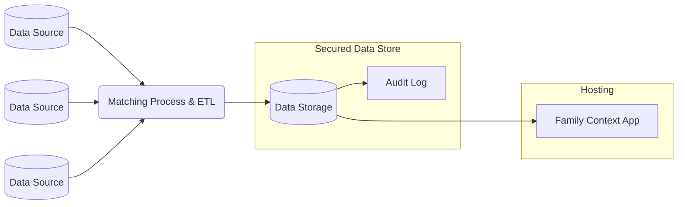

# family-context-django

## Background
The Family Context project has been in the works since June 2018. It is the result of a cross-council collaboration aiming to solve some of the most entrenched problems faced by children’s social services. The primary goal of this collaborative effort is to improve outcomes for some of the most vulnerable people in our society. 

## Problem
When social workers first interact with a family, they do not have easy access to key information on relevant people in the family and the services that have engaged with them. This results in them either taking decisions without this **key information** or spending a **significant amount of time searching for it**.
The consequences are that social workers...
  * …sometimes have **incomplete information** which can change decisions and outcomes for children and families.
   
  * …**waste time** chasing information, which they would prefer to spend with the family on working out a plan.

## Suggested Infrastructure
Family context expects a process similar to the following to be in place:

## Setup
The easiest way to run this is to do the following commands after you have 
[docker installed](https://docs.docker.com/get-docker/):

1. `docker compose build`
2. `docker compose up`
3. You may need to migrate and setup your database. In order to do that, do the following:
   1. `docker exec -it family-context-django-web-1 /bin/sh` to launch an interactive terminal
   2. `poetry run python manage.py migrate` to migrate the database
   3. `poetry run python manage.py createsuperuser` to create an admin user
   4. `exit` to quit the interactive terminal
4. Once running, you can access the website at [http://localhost:8000](http://localhost:8000)

One thing to note, however, is the database does NOT have any data currently in, and you may need to add your own 
records in order to test.

Run `docker compose down` in order to shut down the database and website.