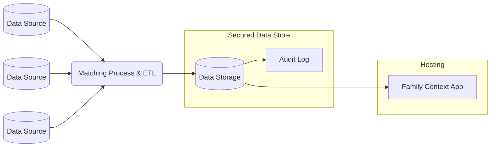

# family-context-django

## Background
The Family Context project has been in the works since June 2018. It is the result of a cross-council collaboration aiming to solve some of the most entrenched problems faced by children’s social services. The primary goal of this collaborative effort is to improve outcomes for some of the most vulnerable people in our society. 

## Problem
When social workers first interact with a family, they do not have easy access to key information on relevant people in the family and the services that have engaged with them. This results in them either taking decisions without this **key information** or spending a **significant amount of time searching for it**.
The consequences are that social workers...
  * …sometimes have **incomplete information** which can change decisions and outcomes for children and families.
   
  * …**waste time** chasing information, which they would prefer to spend with the family on working out a plan.

## Suggested Infrastructure
Family context expects a process similar to the following to be in place:

## Setup
### Running Locally for Development
The following steps can be used to run the service in a way that is easy to develop, keeping the database 
locally and the service easily able to update when changes are made.
1. Install the libraries needed for the project
   1. `poetry install`
   2. Copy the file `.env.sample` to `.env` and fill out the values. If you want to use SQLite, then 
   delete the database variables
   3. `poetry run python manage.py migrate` to setup the database
2. Build the front end 
   1. `cd frontend`
   2. `npm install` to install the required libraries
   3. `npm run build` to build the static files
   4. `cd ..` to return to the root directory
3. Run the service
   1. `poetry run python manage.py collectstatic` This pulls the static files into a central location so the
   application can use them
   2. `poetry run python manage.py setup_test_data #` will generate fake data. Replace '#' with the number of children
   to generate, but don't use too high of a number as the process can take a wile. I recommend about 10 or so.
   3. `poetry run python manage.py createsuperuser` Will give you an admin user you can use to log into the admin page
   4. `poetry run python manage.py runserver` This will run the website on [http://localhost:8000](http://localhost:8000) which you can access 
   on your web browser. The admin site is on [http://localhost:8000/admin/](http://localhost:8000/admin/) where you can use the super user account you 
   created in the earlier step 

### Running locally with Docker
Do the following commands after you have 
[docker installed](https://docs.docker.com/get-docker/):

1. `docker compose -f docker-compose.dev.yaml build`
2. `docker compose -f docker-compose.dev.yaml up`
3. You may need to migrate and setup your database. In order to do that, do the following:
   1. `docker exec -it family-context-django-web-1 /bin/sh` to launch an interactive terminal
   2. `poetry run python manage.py migrate` to migrate the database
   3. `poetry run python manage.py createsuperuser` to create an admin user
   4. `exit` to quit the interactive terminal
4. Once running, you can access the website at [http://localhost:8000](http://localhost:8000)

One thing to note, however, is the database does NOT have any data currently in, and you may need to add your own 
records in order to test.

Run `docker compose -f docker-compose.dev.yaml down` in order to shut down the database and website.

### Fake Data
To generate fake data, simply connect to the web docker image, and run the following command:
`poetry run python manage.py setup_test_data`. Each time you run this, it will delete all Family 
Context Data that is outside the admin (People, Family Relationships, etc) and replace it with 
new randomly generated records.