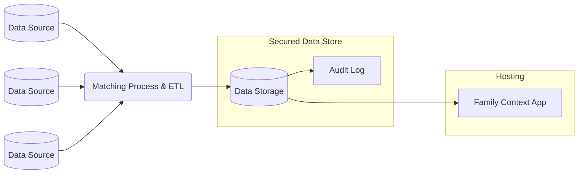

# family-context-django

## Background
The Family Context project has been in the works since June 2018. It is the result of a cross-council collaboration aiming to solve some of the most entrenched problems faced by children’s social services. The primary goal of this collaborative effort is to improve outcomes for some of the most vulnerable people in our society. 

## Problem
When social workers first interact with a family, they do not have easy access to key information on relevant people in the family and the services that have engaged with them. This results in them either taking decisions without this **key information** or spending a **significant amount of time searching for it**.
The consequences are that social workers...
  * …sometimes have **incomplete information** which can change decisions and outcomes for children and families.
   
  * …**waste time** chasing information, which they would prefer to spend with the family on working out a plan.

## Suggested Infrastructure
Family context expects a process similar to the following to be in place:

For more details and recommended CloudFormation starting point for the infrastructure can be 
[found here](./infrastructure/README.md)

## Setup
### Running Locally for Development
The following steps can be used to run the service in a way that is easy to develop, keeping the database 
locally and the service easily able to update when changes are made.
1. Install the libraries needed for the project
   1. `poetry install`
   2. Copy the file `.env.sample` to `.env` and fill out the values. If you want to use SQLite, then 
   delete the database variables
   3. `poetry run python manage.py migrate` to setup the database
   4. Install pre-commit so it runs the formatting rules before every commit: `pre-commit install`.
2. Build the front end 
   1. `cd frontend`
   2. `npm install` to install the required libraries
   3. `npm run build` to build the static files
   4. `cd ..` to return to the root directory
3. Run the service
   1. `poetry run python manage.py collectstatic` This pulls the static files into a central location so the
   application can use them
   2. `poetry run python manage.py createsuperuser` Will give you an admin user you can use to log into the admin page
   3. `poetry run python manage.py runserver` This will run the website on [http://localhost:8000](http://localhost:8000) which you can access 
   on your web browser. The admin site is on [http://localhost:8000/admin/](http://localhost:8000/admin/) where you can use the super user account you 
   created in the earlier step 

### Running locally with Docker
Do the following commands after you have 
[docker installed](https://docs.docker.com/get-docker/):

1. `docker compose -f docker-compose.dev.yaml build`
2. `docker compose -f docker-compose.dev.yaml up`
3. You may need to migrate and setup your database. In order to do that, do the following:
   1. `docker exec -it family-context-django-web-1 /bin/sh` to launch an interactive terminal
   2. `poetry run python manage.py migrate` to migrate the database
   3. `poetry run python manage.py createsuperuser` to create an admin user
   4. `exit` to quit the interactive terminal
4. Once running, you can access the website at [http://localhost:8000](http://localhost:8000)

One thing to note, however, is the database does NOT have any data currently in, and you may need to add your own 
records in order to test.

Run `docker compose -f docker-compose.dev.yaml down` in order to shut down the database and website.

## SSO setup

### AWS Setup
For cognito, be sure to set the following environment variables:

* AWS_REGION - The region your infrastructure exists in. For example, `eu-west-2`
* AWS_COGNITO_USER_POOL_ID - The user pool ID your =eu-west-2_nng2l3Nti
* AWS_COGNITO_APP_CLIENT_ID - THe client ID on your user pool
* AWS_COGNITO_APP_CLIENT_SECRET - The client secret on your client on the user pool
* AWS_COGNITO_DOMAIN - The URL for the cognito domain (This is not the URL users will access the
application, but the one defined in the cognito client). It should look something like this: 
`https://family-context.auth.eu-west-2.amazoncognito.com`

If you're running the service behind a load balancer to handle SSL certificates, etc. Make sure
you use the regular production configuration (NOT the one using certbot) and set the
LOAD_BALANCER_SSL environment variable by setting it to "true". This will ensure that the service
will generate the correct links internally with HTTPS enabled.

### Azure Setup
TBD...

### Creating and Loading Fake Data
If you want to run a demo of this service, you'll need to load some dummy data so that users
can see the search interface. To do this, complete the following steps:

1. Run the following command wherever the service is being run:
`python manage.py generate_dummy_data`. This will generate a bunch of dummy CSV
files based upon the definitions stored in the YAML files located in `./fixtures/structures`.  
Add the --help flag to the above command for CLI options (to change the number of records
generated, to change the chance a person will appear in a given data source, etc).

2. These files, once generated, can be loaded into the database in whatever method you wish, but 
you can use the helper script `python manage.py data_intake file1.csv file2.csv file3.csv ...` 
Where each file you list are the files from the generated data. Run `python manage.py data_intake --help`
for more information on this command.

If you have your own files you can skip the first step and use those files instead in the second step.

### Running in Production
There are many ways to run this service in production. Below are only a few:

#### Docker Compose Basic
You can use the base setup to get the application running by using the following command:
`docker compose -f docker-compose.prod.yaml up` This should create a web container and a database container.
Navigate to [localhost](http://127.0.0.1:8000) on port 8000 to connect to the frontend.

#### Docker Compose NGINX Version
A slightly more detailed setup that allows for caching of static files and also injection of 
any SSL certificates. This will require more setup to enable though! There are two configurations
for nginx available: http only (use the nginx.conf file) or https only (use the nginx.ssl.conf file).
Any SSL certificates need to go into the ./nginx/certs folder. Refer to the [documentation 
there](./nginx/certs/README.md) for more details.

The dockerfile is setup to import whichever file is named "nginx.conf" in that directory.

You will also need to set the `server_name` attribute in the nginx file to match your domain
name (e.g. mywebsiteurl.com).

Using this setup, the URL is on port 80/443 so no need to specify any port in the URL as the
browser will take care of that automatically.

#### Better Production Setup with Certbot
One thing to note is the nginx setup as is will need to be taken down if an SSL certificate
expires. If you want certificates to auto-update, then it would be worthwhile
looking into setting up [certbot](https://certbot.eff.org/instructions?ws=nginx&os=ubuntufocal&tab=standard) 
as way to better automate this process. It will require [some configuration steps](https://www.digitalocean.com/community/tutorials/how-to-scale-and-secure-a-django-application-with-docker-nginx-and-let-s-encrypt#step-4-configuring-certbot-and-let-s-encrypt-certificate-renewal), however.